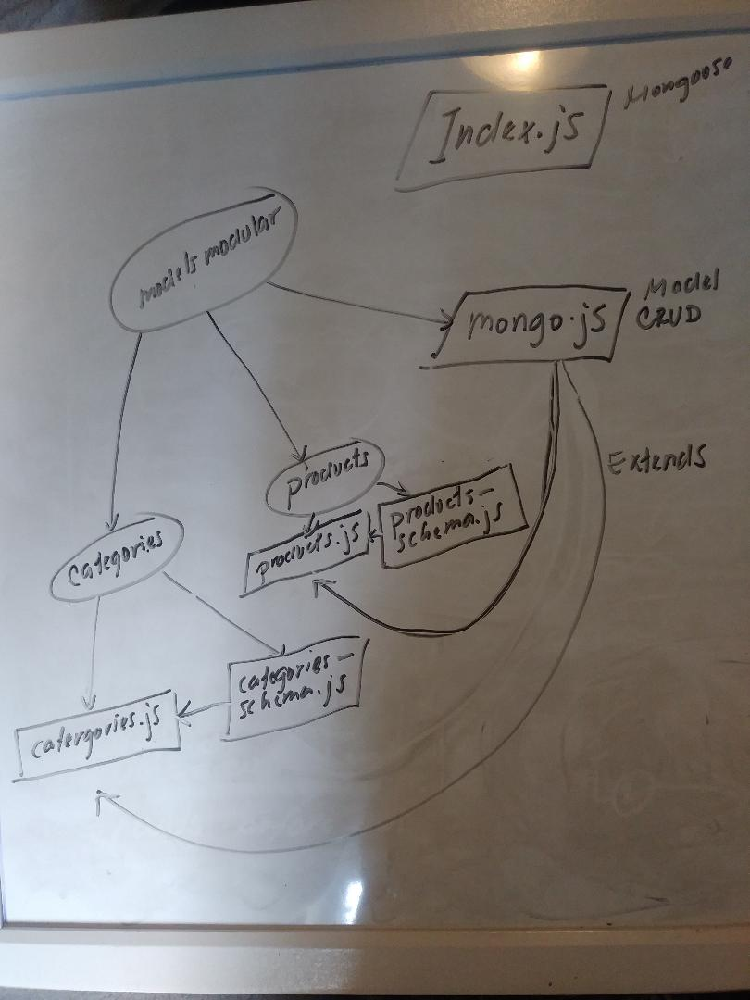

# LAB - 05

## Data Modeling With NoSQL 

### Author: Joseph Hangarter

### Links and Resources
* [submission PR](http://xyz.com)
* [travis]()

### Modules
#### `index.js` - mongoose with mongoDB localhost, `mongoose.connect()` & `mongoose.disconnect()`
#### `mongo.js` - class Model with CRUD method
#### `categories.schema.js` - categories schema with mongoose required in
#### `categories.js` - class Categories extends from `mongo.js`
#### `categories.test.js` - test for `categories.js`
#### `products.schema.js` - products schema with mongoose required in
#### `products.js` - class Categories with CRUD method
#### `products.test.js` - test for `products.js`
#### `supergoose.js` - test against mongo with fake server and fake data

##### Exported Values and Methods
#### `get()` - get what was created
#### `create()` - create value
#### `update()` - update value
#### `delete()` - delete value

#### `.env` requirements
* `MONGODB_URI` - mongodb://localhost:27017/class05

#### Running the app
* `npm start`
* `node module.js`
  
#### Tests
* `npm test`

#### UML

